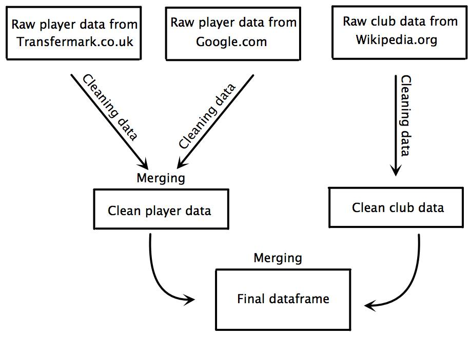

```{r setup, include=FALSE}
knitr::opts_chunk$set(warning=FALSE, message=FALSE, echo = FALSE)

##LIBRARIES
library(plotly)
library("ggmap")# getting maps and coordinates from google
library(maptools)# getting maps and coordinates from google
library(maps)# getting maps and coordinates from google
library("ggplot2")# plotting the data
library(dplyr)#tidying dataset
library(rworldmap)
library(stringr)#dealing with strings and replacing strings in observations
library(RCurl)
library(extrafont)
library(randomForest)
library(tree)
loadfonts()

#creating dataset
df.viz<- read.csv("https://raw.githubusercontent.com/basgpol/SDS-group12/master/Exam_project/transferdata.final.csv", encoding = "UTF8", header = TRUE)

####remove player with transfer fee= 0 et contract time left=0
df.viz<- filter(df.viz,transfer.fee>0)

##GETTING STARTING MAP
myLocation <- "Zurich"
myMap <- get_map(location= myLocation,
                 source="stamen",maptype="toner", crop=FALSE,zoom=4)
##########
##########  MAP CLUB 
##########

#GETTING DATA
df.spending.club<-read.csv("https://raw.githubusercontent.com/basgpol/SDS-group12/master/Exam_project/df_spending_club_with_geo.csv", encoding = "UTF8", header = TRUE)

#WITH GGPLOT
map.clubs <- ggmap(myMap) +
  geom_point(aes(x = lon, y = lat, size=transfer.fee.total), data =df.spending.club,col="red", alpha=0.4)+
  theme(axis.title=element_blank(),
        axis.text=element_blank(),
        axis.ticks= element_line(color=NA),
        axis.line = element_line(color = NA),
        text=element_text(family="Goudy Old Style"))+
  ggtitle("Total transfer spending for clubs in Europe\n2014 2015")+
  labs(size="")+
  scale_size(breaks = c(5.0e+7,1.0e+8,1.5e+8),labels = c("50M£","100M£","150M£"))

##########
##########  MAP TRANSFER 
##########

transfer.path.full = read.csv("https://raw.githubusercontent.com/basgpol/SDS-group12/master/Exam_project/transfer_path_full.csv", header=TRUE, stringsAsFactors=TRUE, fileEncoding="UTF8") # loading saved version of uncleaned player data

##MAAPING 

path.map<-ggmap(myMap)+#calling map
  geom_path(aes(x = lon, y = lat, group = factor(name)), #putting paths on the map
            colour="red", data = transfer.path.full, alpha=0.4)+
  theme(axis.title.x=element_blank(),
        axis.ticks= element_line(color=NA),
        axis.text= element_blank(),
        panel.grid.major.x = element_blank(),
        panel.grid.minor = element_blank(),
        panel.background = element_blank(),
        panel.grid.major.y = element_line(colour="#CACACA", size=0.2), #add grid
        axis.title.y=element_blank(),
        text=element_text(family="Goudy Old Style"))+
  ggtitle("Transfers for season 2014/2015\n")

##########
##########  MAP TRANSFER 
##########

transfer.path.full = read.csv("https://raw.githubusercontent.com/basgpol/SDS-group12/master/Exam_project/transfer_path_full.csv", header=TRUE, stringsAsFactors=TRUE, fileEncoding="UTF8") # loading saved version of uncleaned player data


##MAAPING 

path.map<-ggmap(myMap)+#calling map
  geom_path(aes(x = lon, y = lat, group = factor(name)), #putting paths on the map
            colour="red", data = transfer.path.full, alpha=0.4)+
  theme(axis.title.x=element_blank(),
        axis.ticks= element_line(color=NA),
        axis.text= element_blank(),
        panel.grid.major.x = element_blank(),
        panel.grid.minor = element_blank(),
        panel.background = element_blank(),
        panel.grid.major.y = element_line(colour="#CACACA", size=0.2), #add grid
        axis.title.y=element_blank(),
        text=element_text(family="LM Roman 10"))+
  ggtitle("Transfer for season 2014/2015")

##########
########## MAP TRANSFER+CLUB 
##########

full.map<-ggmap(myMap)+#calling map
  geom_path(aes(x = lon, y = lat, group = factor(name)), #putting paths on the map
            colour="orange", data = transfer.path.full, alpha=0.4)+
  geom_point(aes(x = lon, y = lat, size=transfer.fee.total), data =df.spending.club,col="red", alpha=0.4)+
  theme(axis.title.x=element_blank(),
        axis.ticks= element_line(color=NA),
        axis.text= element_blank(),
        panel.grid.major.x = element_blank(),
        panel.grid.minor = element_blank(),
        panel.background = element_blank(),
        panel.grid.major.y = element_line(colour="#CACACA", size=0.2), #add grid
        axis.title.y=element_blank(),
        text=element_text(family="Goudy Old Style"))+
  ggtitle("Transfer for season 2014/2015\n")+
  labs(size="Transfers spending\n per club")+
  scale_size(breaks = c(5.0e+7,1.0e+8,1.5e+8),labels = c("50M£","100M£","150M£"))

##########
##########  SCATTER PLOT+AGE
##########

p.age = ggplot(df.viz, aes(x = transferage , y = transfer.fee))
p.age<-p.age + geom_point(stat = "identity",col="red",alpha=0.4,aes(text = paste("Name:",name)))+ #to use for ggplot
          geom_smooth(aes(colour = transferage, fill = transferage))+
          ggtitle("Age repartition of transfers in European leagues\n")+
  labs(y="Transfer price\nin M£",x="Age") +
  theme(axis.ticks.y= element_line(color=NA),
        axis.ticks.x=element_line(colour="#CACACA", size=0.2),
        panel.grid.major.x = element_blank(),
        panel.grid.minor = element_blank(),
        panel.background = element_blank(),
        axis.title.y =element_text(angle = 0,
                                   colour="#525252",
                                   vjust = 1,
                                   hjust = 0 ),
        axis.title.x =element_text(angle = 0,
                                   colour="#525252",
                                   vjust = -1,
                                   hjust = 1 ),
        panel.grid.major.y = element_line(colour="#CACACA", size=0.2), #add grid
        axis.title.y=element_blank(),
        text=element_text(family="Goudy Old Style"))

##########
##########  SCATTER PLOT+TIME LEFT
##########

p.time <- ggplot(data=df.viz, aes(x = contract.left.month , y = transfer.fee)) +
  geom_point(stat = "identity",col="red",alpha=0.4,aes(text = paste("Name:",name)))+
  #geom_point(aes(text = paste(name, " to ", club.to)), size = 4) +
  geom_smooth(aes(colour = contract.left.month, fill = contract.left.month))+
  ggtitle("Time left on contract and transfer fees\n")+
  labs(y="Transfer price\nin M£",x="Time left on contract\nin months")+
  scale_x_continuous(breaks=seq(0,58,12))+
  theme(axis.ticks.y= element_line(color=NA),
        axis.ticks.x=element_line(colour="#CACACA", size=0.2),
        panel.grid.minor = element_blank(),
        panel.background = element_blank(),
        axis.title.y =element_text(angle = 0,
                                   colour="#525252",
                                   vjust = 1,
                                   hjust = 0 ),
        axis.title.x =element_text(angle = 0,
                                   colour="#525252",
                                   vjust = -1,
                                   hjust = 1 ),
        panel.grid.major.y = element_line(colour="#CACACA", size=0.2),
        panel.grid.major.x =element_blank(), #add grid
        axis.title.y=element_blank(),
        text=element_text(family="Goudy Old Style"))

##########
##########  BAR CHART+AVERAGE CLUB SPENDING
##########


#finding mean for every league
df.viz.ave<-df.viz %>%
  group_by(league) %>%
  dplyr::summarise(
    sum.transfer=sum(transfer.fee))

df.viz.ave<-df.viz.ave %>%
  mutate(number.of.clubs = ifelse(league=="Bundesliga",18,20)) %>%
  mutate(average.spending=sum.transfer/number.of.clubs)
#ordering
df.viz.ave <- transform(df.viz.ave,
                        league = reorder(league, average.spending))
#plotting it
total.league = ggplot(df.viz.ave, aes( x =league, y=average.spending, fill=league))
total.league<-total.league + geom_bar(stat="identity",alpha=1)+
  theme(axis.title.x=element_blank(),
        axis.title.y =element_text(angle = 0,
                                   colour="#525252",
                                   vjust = 1,
                                   hjust = 0 ),
        panel.grid.major.y = element_line(colour="#CACACA", size=0.2), #add grid
        axis.ticks= element_line(color=NA),
        panel.grid.major.x = element_blank(),
        panel.grid.minor = element_blank(),
        legend.position="none",
        panel.background = element_blank(),
        text=element_text(family="LM Roman 10"))+
  ggtitle("Premier League Clubs spend more on average\n than any other leagues' clubs\n")+
  scale_fill_manual("National leagues",
                    values=c( "#F2E7DA", "#E89090","#92A0B0", "#C0CFAE", "#525252", "#DEE3DC"))+
  labs(y="Average transfer spending\nper league in M£")

##########
##########  BAR CHART+AVERAGE PRICE PER LEAGUE
##########

#finding mean spending per player for different leagues
df.viz.player.league<-df.viz %>%
  group_by(league) %>%
  dplyr::summarise(average.spending.per.player=mean(transfer.fee))

#ordering
df.viz.player.league <- transform(df.viz.player.league,
                        league = reorder(league, average.spending.per.player))
#plotting it
ave.player = ggplot(df.viz.player.league, aes( x =league, y=average.spending.per.player, fill=league))
ave.player<-ave.player + geom_bar(stat="identity",alpha=1)+
  theme(axis.title.x=element_blank(),
        panel.grid.major.y = element_line(colour="#CACACA", size=0.2), #add grid
        axis.ticks= element_line(color=NA),
        panel.grid.major.x = element_blank(),
        axis.title.y =element_text(angle = 0,
                                   colour="#525252",
                                   vjust = 1),
        panel.grid.minor = element_blank(),
        legend.position="none",
        panel.background = element_blank(),
        legend.position="none",
        text=element_text(family="Goudy Old Style"))+
  ggtitle("Premier League Clubs spend more on average\n than any other leagues' clubs\n")+
  scale_fill_manual(
                    values=c( "#E89090","#F2E7DA","#C0CFAE","#92A0B0",  "#525252", "#DEE3DC"))+
  labs(y="Average transfer price\nper player in M£")


##########
##########  BAR CHART+AVERAGE PRICE PER CLUB STATUS
##########

df.viz.status<-df.viz %>% 
  group_by(Status) %>% 
  dplyr::summarise(mean.transfer=mean(transfer.fee))

#Ordering
df.viz.status <- transform(df.viz.status, 
                                  Status = reorder(Status, mean.transfer))

#Plotting

p.club = ggplot(df.viz.status, aes(y= mean.transfer, x = Status, fill=Status))
p.club<- p.club + geom_bar(stat = "identity")+
  theme(axis.title.x=element_blank(),
        axis.text.x =element_text(size  = 9),
        axis.title.y =element_text(angle = 0,
                                   colour="#525252",
                                   vjust = 1),
        axis.ticks= element_line(color=NA),
        panel.grid.major.x = element_blank(),
        panel.grid.major.y = element_line(colour="#CACACA", size=0.2), #add grid
        panel.grid.minor = element_blank(),
        panel.background = element_blank(),
        legend.text=element_blank(),
        legend.title=element_blank(),
        legend.position="none",
        text=element_text(family="Goudy Old Style"))+
  ggtitle("Top Club spend more on average than other leagues' clubs\n")+
  scale_fill_manual(values=c( "#CFF09E", "#A8DBA8", "#79BD9A", "#3B8686"))+
  labs(y="Average transfer price\nper player in M£") 

```
# Introduction

The purpose of this paper is to predict the transfer value of football players in the five major European leagues.[^1] We use a variety of methods from the field of data science to gather, study and lastly predict footballers' transfer value. The paper is structured in three sections: Data gathering, data exploration using different visualisations and prediction modelling.[^2] In the first section we briefly present our data scrapping processes, our sources, the nature of our data and the ethical challenges we considered. In the second section the dataset is transformed into visualisations in order to get an overview of the different obsevations and variables which seems to affect the transfer values. In the final section, we use statistical learning models to predict the transfer values of footballers. The emphasis will be on testing different models and comparing their predictive power on a test set. The paper concludes that the random forest model is slightly better at predicting the footballers' transfer value in our test sample compared to rest of the presented models in the paper. However this model still presents a considerable RMSE, suggesting that its generation might be too complex for the scope of this assignement.   

[^1]: Premier League (England), Bundesliga (Germany), La Liga (Spain), Serie A (Italy) and Ligue 1 (France).
[^2]: All calculations, graphics and writing was conducted using the programming language [R](https://www.r-project.org/) and the IDE [RStudio](https://www.rstudio.com/). 


# Data Gathering

Our data scrapping process relied heavily on the websites Transfermarkt.co.uk, and to a lesser extent on Google.com and Wikipedia.org. Transfermarkt.co.uk contains information on football transfers, player information and  performance statistics. We expect most of this information to be relevant in order to predict the transfer value of a player. We used Wikipedia.org to find data about the final table ranking for the five leagues in the season before the transfers (season 14/15).
To extract the relevant data we build three web scrapers. One for Transfermarkt, another for Google.com and a third for Wikipedia.org. The scraper for Transfermarkt.co.uk both collected all transfer information from the transfer windows "Summer 15" and "Winter 16" in the five leagues and the individual performance statistics from each transfered player. We then used the Google-scraper to gahter information on the number of google hits when searching for the name of each transfered player followed by the word "footballer". It was unfortunately impossible for us to scrape the search information from before the transfer, making it a clearly biased variable, nonetheless interesting for the rest of our analysis. Information on transfer, performance statistics and google hits were then merged into one data frame consisting of player data.
The scraper for Wikipedia ran through the different webpages with the table ranking for the season 14/15 in the five leagues. The table rankings were then merged into one data frame containing the clubs data.
The two different datasets were at first cleaned and then merged into one big dataset containing only the variables thought to be relevant in predicting the transfer values of the players.
We do not find any ethical issues scrapping the data from Google and Wikipedia because the information is publicly available and not private in any way. On the other hand it can be argued that the performance and transfer data is the core of Transfermarkt's business model and they therefore has the right to privacy. We would therefore like to stress that we only use the data for scientific purpose and not a commercial purpose.

Figure 1 below illustrated the data gathering process.



## Data Cleaning

Once the data scrapped from the different websites it had to be cleaned to be merged into one final data set.

### Cleaning The Player Dataset
For the player data we first turn all the unavailable data into NA instead of different signs. Furthermore, we turned the transfer date, end date of contract and birth date into a correct date-format in R. The main reason for this process was to be able to calculate the precise age (in years) and contract period left (in months) at the day of transfer. We afterwards removed all keepers, duplicated observations and observations for which the transfer fee is unknown. The reason for removing the keepers is that our scraped performance data is mostly offensive statistics, which obviously don't describe the performance of goalkeepers and thereby affect their transfer value. At last we divided the players into three different categories: Defender, Midfield and Attacker. The reason for doing this categorization is to have are more simple position variable with fewer categorizes. The simplification enable more intuitive visualizations and predictions.  

### Cleaning The Club Dataset
For the club dataset we started by grouping the different clubs in 4 categories: Top Club (the five highest ranking clubs in the season 14/15), Middle Club (the following ten clubs, ranking from six to sixteen), Bottom Club (the remaining clubs in the league that season) and Promoted Club (clubs that entered the league in season 15/16). Afterwards we renamed the clubs so that they matched the player dataset, which enabled us to merge the player data set and the club data set using leftjoin. Lastly, we selected the variables that we find the most interesting for the later prediction (club name, club status, league) and removed all other variables in our final cleaned club dataset.

### The Final Dataset
The final and tidy dataset contrains 696 observations and 25 variables. A list of each of the variable with a short description is available in the appendix. As stated, the final data set contains a lot of variables. We will therefore in the following section describe how we used different visualizations to explore and select the different variables that seemed the most suited for predicting a football player's transfer value.


\begin{table}[]
\centering
\caption{Variables in the data set}
\label{my-label}
\begin{tabular}{l|l}
\hline
Variables    & Description                           \\ \hline
name         & Name of player                        \\
nationality  & Nationality of player                 \\
birth\_place & Birth place of player                 \\
birth.date   & The date at which the player was born \\
transferage  & Age of player when transfer occurred  \\ 
positions            & Position on field of player                                                  \\
total.goals          & Total amount of goals scored by player                                       \\
penaltygoals         & Total amount of penalty goals scored by player                               \\
total.assists        & Total amount of assists made by player                                       \\
substitutions\_in    & Total amount of matches where player gets substituted in        \\
substitutions\_out   & Total amount of matches where player gets substituted out       \\
total.minutes.played & Total amount of minutes played by player                                     \\
minutes.pr.goal      & Amount of minutes played per goal scored by player                           \\
yellow cards         & Total amount of yellow cards the player got                                  \\
secondyellow         & Total amount of second yellow cards the player got                           \\
redcards             & Total amount of red cards the player got                                     \\
contract.left.month  & Months left of the transfered players' contract at transfer \\
club.to       & Which club player is transferred to       \\
club.from     & Which club player is transferred from     \\
league        & The league that buying club is playing in \\
Status        & Status of the buying club                 \\
transfer.data & Date of transfer                          \\
transfer.fee  & The transfer fee measured in million £    \\
searchresults  & \begin{tabular}[c]{@{}l@{}}Number of search results when you google the\\ player name and 'footballer'\end{tabular}\\
\hline
\end{tabular}
\end{table}


# Data visualisation

The objective of this section is to highlight possible correlations, clear outliers, important variables via the use of data visualisation processes. The creation of maps, scatter plots and bar charts enabled us to have a better understanding of our dataset and convey its most important characteristic in an engaging and simple way. After experimenting different scatterplots, we were able to have a better grasp of the relationship between transfer fees and other variables such as age, position, appearance, total goals and time left on contract.  
In order to transform our dataset into graphs and maps we used different digital tools: GGplot for scatterplots and bar chart, Google maps API for maps, and plotly for interactive visualisation. The dataset used in this visualisations was cleaned by filtering all observations with a transfer fee equal to zero, this resulted in clearer representations.

## A European market dominated by the UK.

&nbsp;

```{r, echo=FALSE, message = FALSE}


map.clubs

```

&nbsp;

This first visual is a mapping of all the clubs buying players with the size of the plots corresponding with their transfer spendings. Making this map allowed us to check the validity of our sample, by comparing it to the most well known clubs and gave us a better overview of the big players in the market. Unsurprisingly, the premier league appeared to have on average more clubs with a higher spending, and the most reknown clubs such as PSG, Real Madrid or Barcelona clearly appeared on the map.

&nbsp;

```{r, echo=FALSE, message = FALSE}


path.map
```

&nbsp;

Our second visualisation focused on the transfer path of each player. This highlighted the fact that the market for football players is a European market, or even a global one and that barriers between countries don't seem to play a big role in transfering players. As you can see on the map, most of the players are traded between countries and not within them.


##A foreseeable repartition of player ages around 25

The scatterplot graph of the relationship between Age and transfer fee shows a convex average curve with a flat top around 25. Perhaps forseeably, most players are traded while in their prime, between 20 and 27 years old. One interpretation might be the the promises of a rising stars are more sought after than the celebrity of an older player. This graph also shows that transfer above 40 millions are the exception.

&nbsp;

```{r, echo=FALSE, message = FALSE}


p.age

```
  
## Time left on contract/Transfer fees

This graph highlights a correlation between the time left on a player's contract and his transfer fee. The more time there is on the contract, the higher a price for a player will be. When the period is less than 20 months, the transfer fees do not exceed 30 million pounds. When more than 20 months, the transfer fees can go up to 30 million pounds - some transfer fees even reach 40 million pounds, when the time left on the contract exceeds 40 months. 

&nbsp;

```{r , echo=FALSE, message = FALSE}


p.time

```
  
## The Premier League spends almost three time as much as the Serie A on new players

&nbsp;

```{r , echo=FALSE, message = FALSE}


total.league

```
  
&nbsp;

This chart shows the spending on transfers in the 5 major leagues in Europe. Average spending are the lowest in the French Ligue 1.The German Bundesliga, the Spanish La Liga and the Italian Serie A all have higher spendings on average than Ligue 1. We also see that the English Premier League dominates the chart with the highest amount of money spent on average. It amounts up to almost free time the average club budget for the second league in terms of spending, the Serie A.

One of the reason of the Premier League hegemony might be its popularity all over the world, resulting in higher TV licensing rights, bigger sales of fan merchandise and a higher attendance during british match. Both being able to buy expensive players and the ambition to remain at the center of international football push british clubs into buying more, and at a higher price( as shown below). It is difficult to say if this loops does not feed itself, and if clubs and agents ask for more money from an english club for the same player.(!It would be nice to include club budgets as a variable to know more on this phenomenon)  

## British clubs spend more money per players

&nbsp;

```{r, echo=FALSE, message = FALSE}

ave.player

```

&nbsp;
    
This graph is not as clear cut as the last one. Premier League is still far ahead other clubs, but Spanish teams actually are closer to spending as much as the Premier League for players. This can be explained by the behavior of the top teams in Spain: Real Madrid, FC Barcelona and Atlético Madrid. Those three clubs spend a lot of money on transfers and try to secure record deals to boost their audience and gain more media coverage. However, this behavior is not followed by other clubs in the league, which may choose not to buy any player, resulting in less player tranfers in total as compared to the premier league. 

## Top Clubs drive the market
  
The following graph shows that the more successful the club is, the more money it can afford to spend on transfers. One interesting feature of this graph however is that the promoted clubs are spending a bit more money on transfer than the bottom clubs. This can be explained by their intention to improve their roster in order to be able to compete in the major league. On the other hand, some of the bottom clubs are relegated, which means that they loose money and therefore cannot afford to spend as much. On top of that, they will compete in the second best league and therefore have a smaller need for transfers.

&nbsp;

```{r, echo=FALSE, message = FALSE}


p.club
```
 
&nbsp;
 

# Prediction models for transfervalue

## Prediction versus causality

The main purpose of this section is to find the best way of predicting transfervalues. We therefore focus on finding the best way to estimate our dependent variable (Y) when we know the value of several different indendent variables (X's) - hereafter called predictors. The issue of prediction stand in contrast to the regular goal in social sciences where we want to estimate the causal effect of one particular independent variable on the dependent variable. The key difference is that the focus shift from the individual effect of a predictor (effects of causes) to the interplay between several predictors and how this interplay can help us predict the value of Y most in the best way. Due to this scientific purpose we use the predictors as signals of a specific transfervalue and do not pay attention to whether they come before Y in time or whether there is an omitted variable bias (?). A good example of this is our use of google hits as a predictor for the players transfervalue. The amount of hits are recorded in real time and therefore after the transfer was made. Due to the time order, the number of google hits can not be the reason why the club bought the particular player for a given price. On the other hand a high number of google hits can signal that the players has had a succesful career or was part of a news generating transfer.  
The predictors used in this section for estimate a players' transfer value are listed below:

## Evaluating prediction models using RMSE
To find the best way of predicting a football players' transfervalue we will make a comparative analysis of the accuracyof five different models. The models we will use to predict the transfervalues are 1) simple average, 2) ordinary least square (linear model), 3) lasso model, 4) decision tree and 5) random forest.  

We measure the models' prediction accuracy by finding the *out of sample error* (the prediction error when applying the models on a dataset on which the model was not trained). The first step of our comparative analysis is therefore to randomly split our data into a *training sample* and a *test sample*. We choose to put 70 percent of the observations in the training sample because we want a sufficiently large amount of observations to train our models.  
We evaluate and compare the models by using the root mean squared error (RMSE) which is stated in the equation below. The RMSE gives us a measure for how well the model predicts the observations in the test sample. We created a function in R to make the RMSE calculation for us. We use the RMSE instead of the more basic mean square error (MSE) because RMSE is more robust to outliers. 

$$ RMSE = \sqrt {{\frac{{\sum\limits_{{i = 1}}^n {{{\left( {{y_i} - {{\hat{y}}_i}} \right)}^2}} }}{{n}}}}$$

The *bias-variance trade-off* is important to keep in mind when dealing with prediction. The reason is that the prediction errors are the sum of errors due to bias and errors due to variance between the training and test sample. When we build our prediction models, we do it on the availiable data in the training sample which also include standard noise. If we on the one hand build a model with only a few variables the model will not be able to comprehent the complexity of the real world. Due to this *underfitting* we therefore end up with a biased model who's estimates are quite far from the real world values. If we on the other hand increase the number of variables and thereby the model's complexity alot then the model will adjust to much to the training sample. The result of this *overfitting* will be prediction errors due to the variance between the training sample and the real world. The take-away point is therefore that the most accurate models have found a balance between over- and underfitting so that the increase in bias is equivalent to the decrease in variance. The trade-off is illustrated below:


Find graph here: http://scott.fortmann-roe.com/docs/BiasVariance.html 

## Simple Average
As the first prediction model we use the simple transfer fee average. This is a good baseline model because it is the simplest way of estimating a player's transfer value without using any other variables as predictors. When we use the mean transfer fee in the training sample on the test sample we get a RMSE at 9.06.

Because the simple average is not using any predictors for the estimation we cannot expect it to be very good at predicting the player's individual transfer value. The high amount of prediction errors is illustrated below:

```{r, include=FALSE}
knitr::opts_chunk$set(echo = TRUE)
library(caret)
library(plotly)
library(ggplot2)
library(glmnet)
library(dplyr)
library(plotly)
library(randomForest)

## Loading the final data set
transfer.data = read.csv("https://raw.githubusercontent.com/basgpol/SDS-group12/master/Exam_project/transferdata.final.csv", encoding = "UTF8", header = TRUE)
## Creating a new variable which is age squared
transfer.data$transferage_sq = transfer.data$transferage^2

## creating a vector with selected predictors for transferfee ()
predicting.var = c("transfer.fee", "positions", "appearances", "total.goals", "total.assists", "total.minutes.played", "contract.left.month","transferage",
"league", "Status", "searchresults","transferage_sq")
## Removing observations where contract lenght is unknown
transfer.data=filter(transfer.data , is.na(contract.left.month) == FALSE) 

##================ 4.1 Dividing into a train and test sample  ================
## Creating a vector with the count of 70 pct. of the sample size  
train_size = floor(0.70 * nrow(transfer.data)) # creates a vector 
## setting seed to enable reproductivity 
set.seed(123)
## creating a vector with random numbers (count = tran_size)
train.indicator = sample(seq_len(nrow(transfer.data)), size = train_size)
## Splitting the data frame into a train (70 pct.) and test sample (30 pct.)
train_sample = transfer.data[train.indicator,predicting.var] # selecting observations with a train indicator
test_sample = transfer.data[-train.indicator, predicting.var] # selecting observations without a train indicator
## creating a function that calculate the RMSE
get.rmse = function(real, estimate){
  return(sqrt(mean((real - estimate)^2)))
}
##================ 4.3 Baseline model: Simple average from training sample  ================
estimate_M1 = mean(train_sample$transfer.fee) #calculating estimate from model 1
get.rmse(test_sample$transfer.fee, estimate_M1) # calculating RMSE from estimate on test sample 
#create new data frame
train_sample.1<- train_sample %>% 
  select(transfer.fee,league) 
train_sample.1<- train_sample.1%>% 
  mutate(index=1:258)
#creating GGplot for visualisation
p = ggplot(train_sample.1, aes(x = index , y = transfer.fee))+
  geom_segment(aes(x= index, xend=index, y=transfer.fee, yend=estimate_M1), color="red") +
  geom_point(aes(x = index, y = transfer.fee, color = "black"))   +
  geom_line(aes(x = index, y = estimate_M1), color="green", size =1)+
  theme(axis.title.x=element_blank(),
        axis.text.x =element_blank(),
        axis.ticks= element_line(color=NA),
        panel.grid.major = element_blank(),
        panel.grid.minor = element_blank(),
        panel.background = element_blank())
```

```{r fig.width=7, fig.height=7, fig.pos="placeHere",fig.cap="Prediction errors",echo=FALSE, message=FALSE, warning=FALSE}
p
```

## Ordinary least square
As the second prediction model we use the linear regression model - ordinary least square (OLS). OLS works by minimizing the *sum of squared residuals* (SSR) and is thereby also minimizing the bias. Unfortunately, the goal of minimizing the in-sample errors lead to a risk of overfitting and thereby increase the errors due to variance. Therefore, OLS is often not the best prediction methods. On the other hand, OLS is a very good method when inference is the goal because the model's significance can be tested. When we apply our OLS model on the test sample we receive a RMSE of 6.34, which is much lower than the RMSE for the simple average.

## The Lasso model
One way to deal with the problem of overfitting is the Lasso model. The Lasso model punishes complexity by adding a loss function to the OLS-equation:  
$$ \operatorname*{minimize}_{\beta_j}: \sum_{i=1}^n (y_i-\beta_0-\sum_{i=1}^p\beta_jx_{ij}^2)+\lambda\sum_{j=1}^p|\beta_j| $$
From the equation above we see a clear trade-off between minimizing the SSR and the penalty term. The penalty is given by the sum of the absolute $\beta$ coefficients. For a given $\lambda$ the model returns a corner solution of the most significant variables. The $\lambda$ parameter weights the penalty according to the complexity of the model. The larger $\lambda$, the heavier a penalty which lead to exclusion of more variables. The Lasso is performing so-called *variable selection*. 
The optimal size of $\lambda$ is decided by running the regression on our training data for different values of $\lambda$. For each of the estimated models we estimate the expected transfer values in the test data. We then calculate the RMSE for all the different models and find the $\lambda$ which minimizes the RMSE in our test data.
The model with the optimal $\lambda$ has a RMSE of 6.34. Therefore, overfitting doesn't seem to be an issue for our regular OLS estimate since the weighting of the penalty term is very low ($\alpha=0.0009$) and the Lasso gives a slightly higher out of sample error compared to the regular OLS (the RMSE values in the paper are rounded).

## Regression Trees
Decision trees is a machine learning method which can be applied on both categorical and continuous variables. When used for predicting continuous outcomes (such as transfer value) the methods is called *regression trees*. The decision tree is grown by using our training data in the following way: First the predictor space (set of all the possible values for our explanatory variables) is divided into $J$ different regions. For all observations in one region the prediction is given by the mean of the observed dependent variable. The regions are constructed in a way that minimizes the SSR:
$$ \sum_{j=1}^J\sum_{i \in R_j}(y_i-\hat{y}_{R_m})^2$$

It is computationally infeasible to consider all possible partitions of the feature spaces into $J$ regions. Therefore an a approach called *recursive binary splitting* is used (*An Introduction to Statistical Learning*). In our case the first split is searchresults>50300 which means that this division of the observations provides the greatest reduction of the SSR of all possible first splits across all predictors and all values.  
There is a risk that this procedure will lead to overfitting. To avoid this we can use a procedure called pruning. To prune the tree we use the following equation:
$$ \sum_{m=1}^{|T|}\sum_{x_i \in R_j}(y_i-\hat{y}_{R_j})^2+\alpha|T|  $$
$|T|$ is the number of terminal nodes in the subtree $T$, $R_m$ is the subspace of the region M, and $y_{R_m}$ is the predicted response associated with $R_m$. When pruning the tree we obtain a sequence of the best subtrees as a function of $\alpha$. We are then using *K-fold cross-validation* (that is we are dividing the training data into K folds) to choose the right $\alpha$ value.
A new tree is grown on all but the *k*th fold of the training data. The process is repeated for each value of $\alpha$. All the grown trees are evaluated by calculating the MSE on the *k*th fold. The $\alpha$ value with the lowest average MSE across the folds are choosen and then used on the original tree.
As with the Lasso model overfitting wasn't an issue and the original tree produced a lower RMSE than the pruned one. The RMSE was 6.60.
  
```{r fig.width=7, fig.height=7, fig.pos="placeHere",fig.cap="Decision Tree",echo=FALSE, message=FALSE, warning=FALSE}
library("tree")
library(caret)
library(plotly)
library(ggplot2)
library(glmnet)
library(dplyr)
library(plotly)
## Loading the final data set
transfer.data = read.csv("https://raw.githubusercontent.com/basgpol/SDS-group12/master/Exam_project/transferdata.final.csv", encoding = "UTF8", header = TRUE)
## Creating a new variable which is age squared
transfer.data$transferage_sq = transfer.data$transferage^2


## creating a vector with selected predictors for transferfee ()
predicting.var = c("transfer.fee", "positions", "appearances", "total.goals", "total.assists", 
               "total.minutes.played", "contract.left.month","transferage",
               "league", "Status", "searchresults","transferage_sq")
## Removing observations where contract lenght is unknown
transfer.data=filter(transfer.data , is.na(contract.left.month) == FALSE) 


##================ 4.1 Dividing into a train and test sample  ================

## Creating a vector with the count of 70 pct. of the sample size  
train_size = floor(0.70 * nrow(transfer.data)) # creates a vector 

## setting seed to enable reproductivity 
set.seed(123)

## creating a vector with random numbers (count = tran_size)
train.indicator = sample(seq_len(nrow(transfer.data)), size = train_size)

## Splitting the data frame into a train (70 pct.) and test sample (30 pct.)
train_sample = transfer.data[train.indicator,predicting.var] # selecting observations with a train indicator
test_sample = transfer.data[-train.indicator, predicting.var] # selecting observations without a train indicator


Model_4=tree(transfer.fee~.,data=train_sample, method="anova")

plot(Model_4,niform=TRUE, 
     main="Regression Tree for Transfer fee ")
text(Model_4,pretty=0,use.n=TRUE, cex=.5)

```


The figure illustrates the regression tree made to predict the transfer value. The first node assign observations with less than 50300 search results to the left branch. The next node of the left branch assign players with less than 31.885 month of the contract left to the left branch and so on. In our model the tree segments the players into 11 leaves and predicts a transfer fee for each of these subgroups. The variables at the top of the tree is the most important ones and the lenght of a branch shows the relative importance of the split. Hence, in our model search results is the most important predictor of a players transfer value.

## Random Forest
As described above the decision tree has issues with overfitting which create errors due to variance. The issues can be reduced by another prediction method called *random forest* (RF). The RF is a socalled ensemple model which means that the model consist of several smaller decision trees (in this case regression trees). RF has great simalarities with the concept of *bagging* or *bottstrap aggregating* (Breiman, 1996) where the core idea is to reduce the error due to variance from one model by  building several models and use their average prediction. A random forest prediction can by divided into 4 steps:  
1) First, each regression tree is constructed by randomly draw and replace (called bootstrap sampling) 63.2 percent of the observations in the training sample. This is in our rapport done 500 (?) times so we in the end have a forest of 500 different trees with random selected observations from the traning sample.    
2) In the next step each tree randomly select *m* number of the predictor variables in the data set. For regression trees likes these m is equal to the total number of all predictors divided by 3. All 500 trees use the same number of variables. The purpose of randomly choose predictors is to prevent very important variables from overshadowing the effect of weaker variables. This often happens because the underlying algorithm search for the split with the largest decrease in the loss function.  
3) Thirdly, each tree calculate the out of bag error rate using the remaning 36.8 percent of the data.  
4)In the last step the average prediction are calculated out of all predictions from each individual tree.

In theory, RF does not need a seperate test sample to examine the validity of the results. The validity is measured internally by the out of bag error rate. In this report we have used a seperate test sample. The reason is that we wanted to calculate the RMSE so we can compare the RF model's predictive power to the previous prediction models.  
The RMSE of the RF on the test sample is 6.26.

We can also use the RF to calculate and rank the importance of each predictor in the data set. This is done by calculating *%IncMSE*. The %IncMSE states the percentage increase of the mean squared error (estimated with the out-of-bag error rate) if the particular variable is permuted (which mean that the values are randomly shuffled). The higher the number the more important is the variable. The %IncMSE of different predictors are listed in the table below. As with the decision tree google searchresults is shown to be the most important variable.    

```{r, include = FALSE}
Model_5 = randomForest(transfer.fee ~ ., data = train_sample, importance = TRUE)
print(Model_5)

estimate_M5 = predict(Model_5, test_sample) # calculating estimate from model 5
get.rmse(test_sample$transfer.fee, estimate_M5) # calculating the RMSE on test sample

var.list = importance(Model_5, type = 1) #calculate the variables influence
varImpPlot(Model_5) # plots the variables influence

```

\begin{table}[]
\centering
\caption{Variable importance}
\label{my-label}
\begin{tabular}{ll}
\hline
Variables           & \%IncMSE \\ \hline
posistions          & 0.35     \\
appearances         & 8.00     \\
total.goals         & 5.44     \\
total.assists       & 2.67     \\
contract.left.month & 6.32     \\
transferage         & 4.26     \\
league              & 2.52     \\
Status              & 5.67     \\
searchresults       & 16.21    \\
transferage\_sq     & 4.79     \\ \hline
\end{tabular}
\end{table}

# Conclusion
In this paper we try to predict the transfer value of football players. To answer the initial question we first created several webscraping functions to collect a dataset containing information about transfers made in the season 15/16 in the five major european leagues, the players performance statistics in the season prior to the transfer and information about the buying club's latest results. We scraped the data from Transfermarkt.co.uk, Google.com and Wikipedia.org. After the data gathering and cleaning we ended up with a tidy data set of 696 observations and 25 variables.  
To select the best predictors out of all 25 variables in the data set we used several visualizations to search for correlation patterns. Furthermore, we used the Google Maps API to visualize our data sample. We then selected 11 predictors which all seemed to have an influence on the players' transfervalue.  
In the third and last section we built five different predictions models using a training sample. The models we built were a simple average, OLS, lasso, decision tree and random forest. The accuracy of each prediction model was evaluated by calculating the RMSE on the test sample. The result of the comparative analysis shows that a simple average is not suprisingly the worst estimate of individual players transfer value. The four remaining prediction models are much closer to each other with a RMSE of around 6.5 although the machine learning method random forest showed the lowest out of sample error rate (RMSE of 6.26).  
If we take the average transfer value of 5.6 million ? into consideration then is a RMSE of 6.5 very high (the same unit as the transfer value variable). This indicate that our prediction models are far from well specified.


\begin{table}[]
\centering
\caption{Summary RMSE}
\label{my-label}
\begin{tabular}{ll}
\hline
Model           & RMSE \\ \hline
Average         & 9.06 \\
OLS             & 6.34 \\
Lasso           & 6.34 \\
Regression Tree & 6.60 \\
Random Forest   & 6.26 \\ \hline
\end{tabular}
\end{table}

\newpage
# Litterature

**Fortmann-Roe, Scott. 2016.** "Understanding the Bias-Variance Tradeoff". Located at: http://scott.fortmann-roe.com/docs/BiasVariance.html.

**Friedman, Jerome, Trevor Hastie, and Robert Tibshirani. 2001.** "Introduction to statistical learning". Vol. 1. Springer, Berlin: Springer series in statistics. Located at: http://www-bcf.usc.edu/~gareth/ISL/ISLR%20Fourth%20Printing.pdf

\newpage
# Appendix

[inser stuff to appendix]